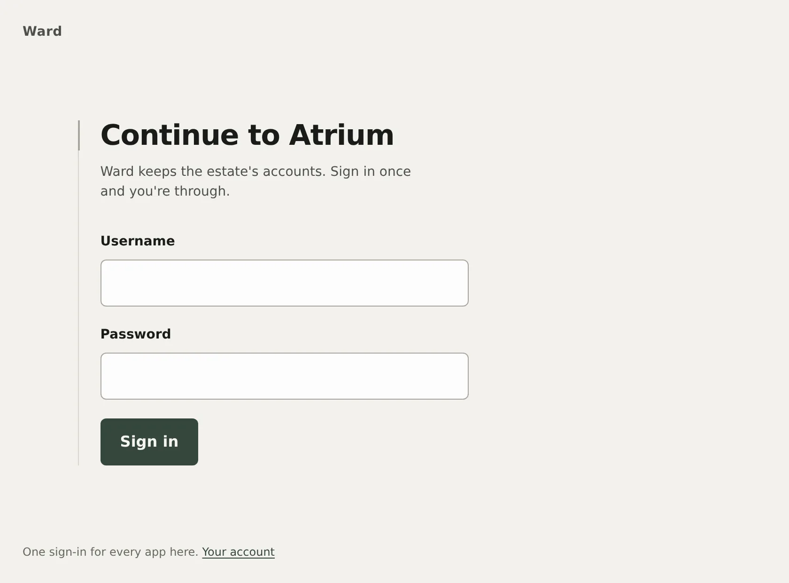
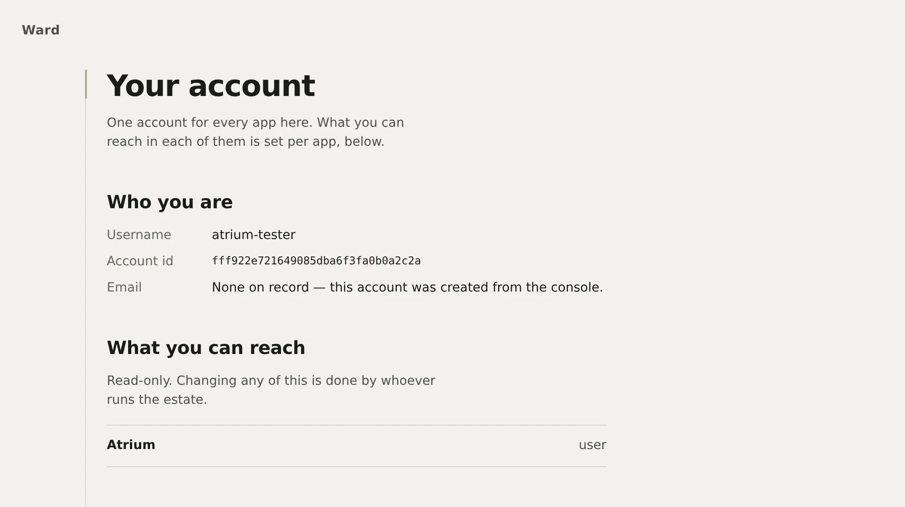
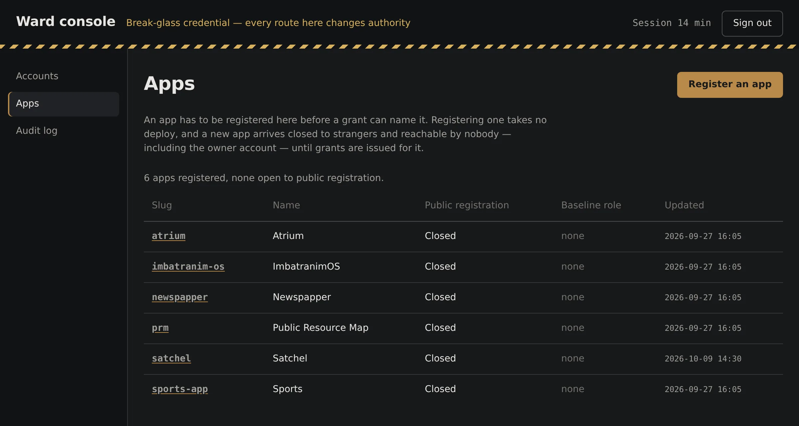
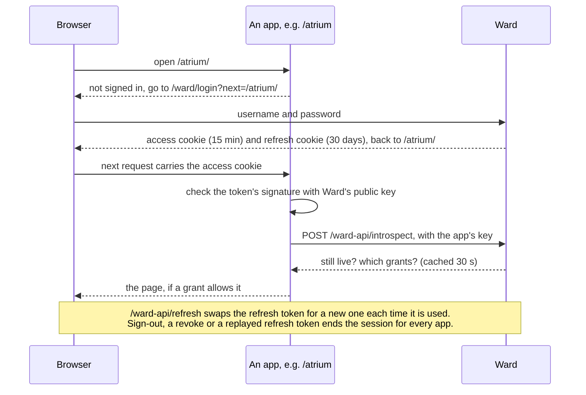

# Ward

The sign-in service for the side projects on gandolh.ro. A person has one account for all of them
and signs in on one page, and a grant per app decides what they can open.

<p align="center">
  
</p>

**Status:** Personal project, in production since 2026-10-04 at <https://gandolh.ro/ward/>. Four
apps sign in through it: atrium, newspapper, public-resource-map and sports-app. Satchel is
registered for local development. The GitHub repo is `gandolh/ward-auth` and the folder is still
called `wzd_auth`; the service is Ward ([why](corpus/wiki/overview.md#naming)).

## What it does

- Gives every app the same login page, `/ward/login`. An app sends a signed-out visitor there with
  `?next=`, and Ward sends them back signed in.
- Lets an app check a visitor without calling Ward on every request. The app verifies a 15-minute
  signed token itself, and asks Ward at most once every 30 seconds whether that session is still
  live.
- Decides access per app with grants: an account, an app, a role. A newly registered app lets
  nobody in until grants are issued, and public sign-up stays off unless the app turns it on.
- Ends sessions in one place: signing out, "sign out my other devices" (a password change does the
  same), or a revoke from the admin console. Every app stops accepting the session within 30
  seconds. A spent refresh token that turns up again revokes the whole session, because that is
  what a stolen cookie looks like; two tabs refreshing at the same moment are the one exception.
- Lets an app email its own users through `POST /notify` without ever seeing their addresses.

Every app here lives under a path on one origin, so the cookie Ward sets already travels with the
next request to any of them. That is why Ward is a small Fastify service and not an OIDC provider
such as Keycloak or Authentik. There is no code exchange or token relay to do. It has no OAuth,
social sign-in, passkeys or two-factor, and it cannot serve apps on another domain. The options it
was weighed against are in [corpus/wiki/landscape.md](corpus/wiki/landscape.md).

## Screenshots

The account page shows a signed-in person who they are and which apps they can reach.



The admin console's app list, on a local copy of Ward. The console only accepts a break-glass login
set in Ward's environment; no account, not even the owner's, can reach it.



## How it works

Ward has two parts on one origin. The API at `/ward-api` is Fastify on SQLite and holds the one
Ed25519 signing key. The React UI at `/ward` has the login, account and console pages. Apps share no
code with Ward. Each carries a short client of its own written against
[the integration contract](corpus/wiki/integrating.md), and `client/` here is the tested reference
version. A session goes like this:



Rotation, the stolen-cookie alarm and the two-tab race that is not theft are on the docs site's
[Sessions and tokens](https://gandolh.ro/ward/docs/sessions/) page
([source](docs/src/content/docs/sessions.mdx)). The full picture is
[Architecture](https://gandolh.ro/ward/docs/architecture/)
([source](docs/src/content/docs/architecture.mdx)).

## Run it locally

Requires Node 22 or later (`.nvmrc` pins 24), and Docker to run Ward itself.

```bash
npm install
npm test             # Vitest across api, client and ui
npm run typecheck
npm run lint
npm run build
```

To run Ward with its UI, follow [infrastructure/local/README.md](infrastructure/local/README.md).
Docker Compose serves it at <http://localhost:8792>, a seed script registers the apps and writes
each app's local key, and each app's dev server forwards `/ward` and `/ward-api` to it. Environment variables are
listed in [.env.example](.env.example).

## Project layout

| Path              | What lives there                                                                             |
| ----------------- | -------------------------------------------------------------------------------------------- |
| `api/`            | The Fastify API: sign-in, sessions, grants, app keys, mail, the console's routes, migrations |
| `ui/`             | The React UI served at `/ward`: login, register, verify, account and the console             |
| `client/`         | `@ward/client`, the reference client apps copy from; nothing installs it                     |
| `docs/`           | The docs site at `/ward/docs` (Starlight), plus the images in this README                    |
| `infrastructure/` | The container image and compose file; `local/` runs Ward in Docker                           |
| `corpus/`         | The project wiki: decisions, status and the briefs that built Ward                           |

## Docs

- [docs/](docs/README.md): what is in the docs folder, and the images used here
- Docs site: <https://gandolh.ro/ward/docs/>, with the HTTP API, the data model, configuration and
  the [`@ward/client` reference](https://gandolh.ro/ward/docs/reference/client/)
- [Integration contract](corpus/wiki/integrating.md): what an app must get right to sign in
  through Ward
- [Project wiki](corpus/index.md): decisions, status and the briefs that built it

## License

No LICENSE file yet. `package.json` declares MIT.
